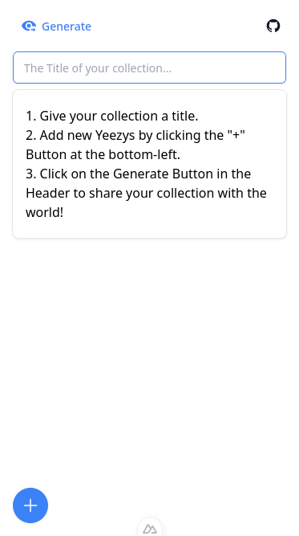
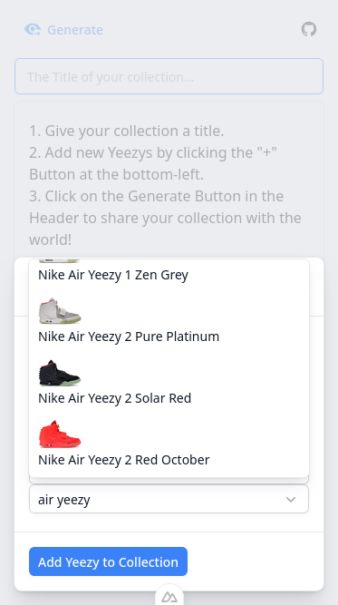
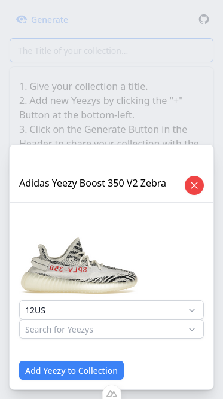
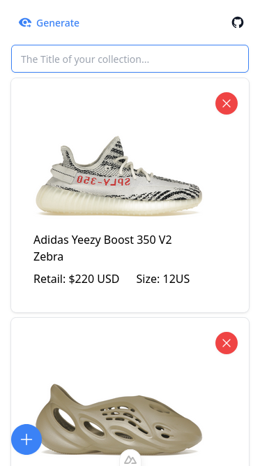
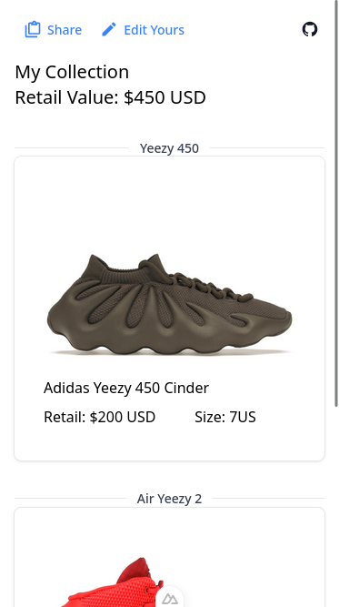

# Yeezy Collection

⚠️ **Update Aug 26 2024: Currently this project is offline.** It will still work locally, it is just not hosted anymore.

https://yeezy-collection.vercel.app

This is an app to manage and share your collection of Yeezy Sneakers.  
Disclaimer: This project is not affiliated with the Yeezy Brand, Ye (fka Kanye West), Nike, or Adidas.

## Screenshots

|                         |                          |                       |                              |                        |
| ----------------------- | ------------------------ | --------------------- | ---------------------------- | ---------------------- |
|  |  |  |  |  |
| Title Screen            | Search for Yeezys        | Adding Yeezys         | Managing your Collection     | Viewing a Collection   |

## Running locally

1. Clone this repository
2. Crate a new Supabase Collection
3. Crate an `.env` File with your `SUPABASE_URL` and `SUPABASE_KEY` Environment Variables
4. Install with `yarn`
5. Run with `yarn run`
6. Open http://localhost:3000/ in your browser

## Contributing

Found a bug or have a feature request? Feel free to open an issue.  
Alternatively, pull requests are also always welcome.

Thanks for any kind of contribution.

## Built with

-   [Nuxt](https://nuxt.com/)
-   [Nuxt UI](https://ui.nuxt.com/)
-   [Pinia](https://pinia.vuejs.org/)
-   [Supabase](https://supabase.com/)

